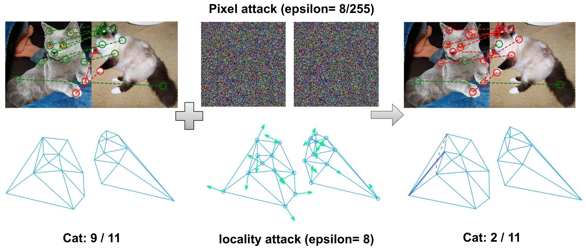

# Appearance and Structure Aware Robust Deep Visual Graph Matching: Attack, Defense and Beyond

Code for [CVPR 2022](https://cvpr2022.thecvf.com/) Paper: "Appearance and Structure Aware Robust Deep Visual Graph Matching: Attack, Defense and Beyond" by Qibing Ren, Qingquan Bao, Runzhong Wang, and Junchi Yan.


<!--  -->

## News

03/27/2022 - Our code is released.

## Requisite

The codes are modified based on [ThinkMatch](https://github.com/Thinklab-SJTU/ThinkMatch) and the basic environment settings also follows it. Here we recommend users to utlize Docker for a quick setup of environments. As for maunal configuration, please refer to [ThinkMatch](https://github.com/Thinklab-SJTU/ThinkMatch) for details.

### Docker (RECOMMENDED) from _ThinkMatch_

1. We maintain a prebuilt image at [dockerhub](https://hub.docker.com/r/runzhongwang/thinkmatch): ``runzhongwang/thinkmatch:torch1.6.0-cuda10.1-cudnn7-pyg1.6.3``. It can be used by docker or other container runtimes that support docker images e.g. [singularity](https://sylabs.io/singularity/).
2. We also provide a ``Dockerfile`` to build your own image (you may need ``docker`` and ``nvidia-docker`` installed on your computer).

## What is in this repository

1. `train_eval.py` is about the robust training pipeline while `eval.py` is the evaluation codes.
2. For `attack_utils.py`, it defines the class `AttackGM` that implements our locality attack including several attack baselines.
3. Moreover, `src/loss_func.py` implements our regularization loss via the parent class `GMLoss`.
4. `src/utils/config.py` defines a global hyper-parameter dictionary `cfg`, which is referenced everywhere in this project.

## Run the Experiment

Run training and evaluation

```bash
python train_eval.py --cfg path/to/your/yaml
```

and replace ``path/to/your/yaml`` by path to your configuration file. For example, to reproduce the ASAR-GM (config 1):

```bash
python train_eval.py --cfg experiments/config1.yaml
```

For reproducibility, we release the three configurations of our ASAR-GM in ``experiments/``, namely ``config1.yaml``, ``config2.yaml``, and ``config3.yaml`` respectively.

To perform various while-box attacks shown in Paper, run the fllowing script:

```bash
python train_eval.py --cfg experiments/eval.yaml
```

To perform various black-box attacks shown in Paper, run the fllowing script:

```bash
python eval.py --cfg experiments/eval_blackbox.yaml --black
```

Note that you need to specify the model path to the variable ``PRETRAINED_PATH`` for model parameters being loaded. Your are welcome to try your own configurations. If you find a better yaml configuration, please let us know by raising an issue or a PR and we will update the benchmark!


## Pretrained Models

_RobustMatch_ provides pretrained models of the three configurations of ASAR-GM. The model weights are available via [google drive](https://drive.google.com/drive/folders/1--oZxLn8Oo_JwL_V7QAJ8li1FVuCNqYg?usp=sharing).

To use the pretrained models, firstly download the weight files, then add the following line to your yaml file:

```yaml
PRETRAINED_PATH: path/to/your/pretrained/weights
```

## Citing this work

```
@inproceedings{ren2022appearance,
    title={Appearance and Structure Aware Robust Deep Visual Graph Matching: Attack, Defense and Beyond},
    author={Qibing Ren and Qingquan Bao and Runzhong Wang and Junchi Yan},
    booktitle={CVPR},
    year={2022}
}
```
